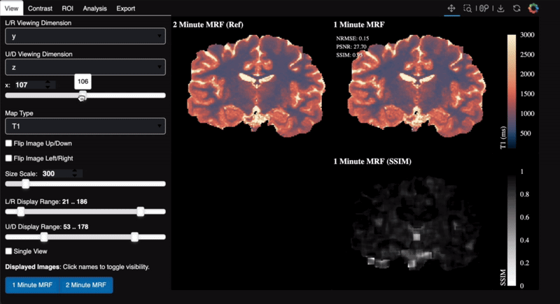
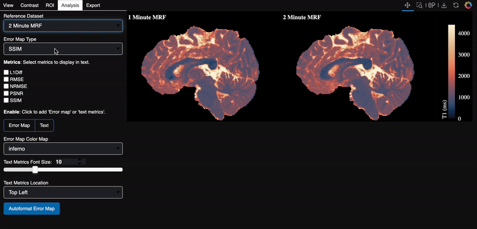
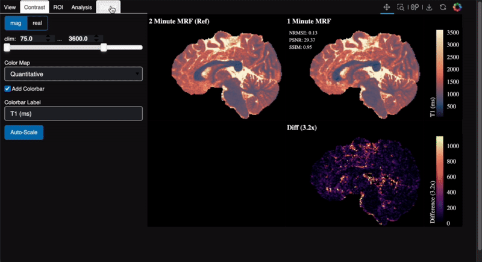
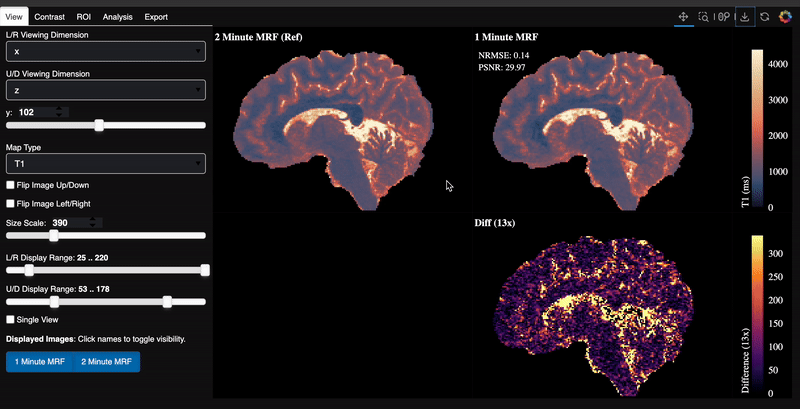

# pyeyes

Pyeyes is a n-dimensional data visualization tool for comparing images. Especially designed as an MRI visualization tool, inspired by FSLEyes. Built on top of [Holoviews](https://holoviews.org/) and [Bokeh](https://bokeh.org/) for interative plotting.

---

## Table of Contents

- [Features](#features)
- [Installation](#installation)
  - [Using PyPI](#using-pypi)
  - [Development](#development)
- [Examples](#examples)
  - [Recommended Usage](#recommended-usage)
  - [Minimal Usage](#minimal-usage)
  - [Use with Quantitative Maps](#use-with-quantitative-maps)
- [Contributing](#contributing)

---

## Features

**Interactive Slicing:** Seemlessly navigate through MRI volumes of arbitrary dimensionality.
**Dynamic Contrast Adjustment:** Toggle through different color maps, color limits, and more on the fly.



**ROI Tools**: Add "Region of Interest" to plot views.


**Comparative Metrics:** Get quick looks at standard image-processing metrics against your gold-standard datasets.



**Repeatability:** Save viewer configurations you like and export static figures with ease.



**Export:** Save figures with built-in Bokeh toolbar.




## Installation

### Using PyPI
Install the package and all dependences from pip manager:
```
pip install pyeyes
```

### Development
Alternatively, for contributing, create the relevant dev environment using mamba:
```
mamba env create -n pyeyes --file env.yml
```

Activate the installed environment:
```
mamba activate pyeyes
```

## Examples

### Reccomended Usage
Pyeyes viewer takes basic specifications on the shape of the data, all of which are optional, but helpful for making navigating your data easier!


```python
import numpy as np
from pyeyes import ComparativeViewer, set_theme

# Optional - Choose from 'dark', 'light', and 'soft_dark'.
# Default theme is 'dark'
set_theme('dark')

# Form Dictionary of Datasets to view
img_dict = {
    "Dataset 1": np.random.randn(3, 100, 100, 100, 12),
    "Dataset 2": np.random.randn(3, 100, 100, 100, 12),
}

# Describe the dimensionality of the data
named_dims = ["Contrast", "x", "y", "z", "Vol"]

# Decide which dimensions to view upon launch
view_dims = ["y", "z"]

# Allow categorial dimensions to be specified.
cat_dims = {"Contrast": ["SE", "MPRAGE", "FLAIR"]}

# Once launched, viewer config can be saved to config
# path for repeating view with same or different data
config_path = "/your/config/path/here.yaml"

# Initialize
Viewer = ComparativeViewer(
    data=img_dict,
    named_dims=named_dims,
    view_dims=view_dims,
    config_path=config_path,
)

# Launch viewer in web browser!
Viewer.launch()
```

### Minimal Usage
The `ComparativeViewer` can also be run with no added description of data. This is useful for quick debugging.

```python
import numpy as np
from pyeyes import ComparativeViewer

# Your data
data = np.random.randn(3, 100, 100, 100, 12)

# Launch viewer in web browser
ComparativeViewer(data).launch()
```

### Use with Quantitative Maps
`pyeyes` supports the Quantitative relaxometry colormaps standardized by [CIG-Utrecht](https://cig-utrecht.org/blog/2023/11/27/colormap-relaxometry.html). To use,
specify Quantitative maps as a categorial dimension as shown below.

```python
import numpy as np
from pyeyes import ComparativeViewer

# Basic dataset parameters
img_dict = {"MRF": np.random.randn(3, 200, 200, 200)}
named_dims = ["Map Type", "x", "y", "z"]
view_dims = ["x", "y"]

"""
Automatic colormap selection is based on the string name for each category:
- "T1" or "R1" will use the Lipari colormap
- "T2", "T2*", "T2s", or any of the "R2" variants will use the Navia colormap
- Any other categories supplied will default to "grey" colormaps
"""
cat_dims = {"Map Type": ["PD", "T1", "T2"]}

# Launch
ComparativeViewer(
    data=img_dict,
    named_dims=named_dims,
    view_dims=view_dims,
    cat_dims=cat_dims,
).launch()
```


# Contributing

Before contributing, run
```bash
pre-commit install
```
